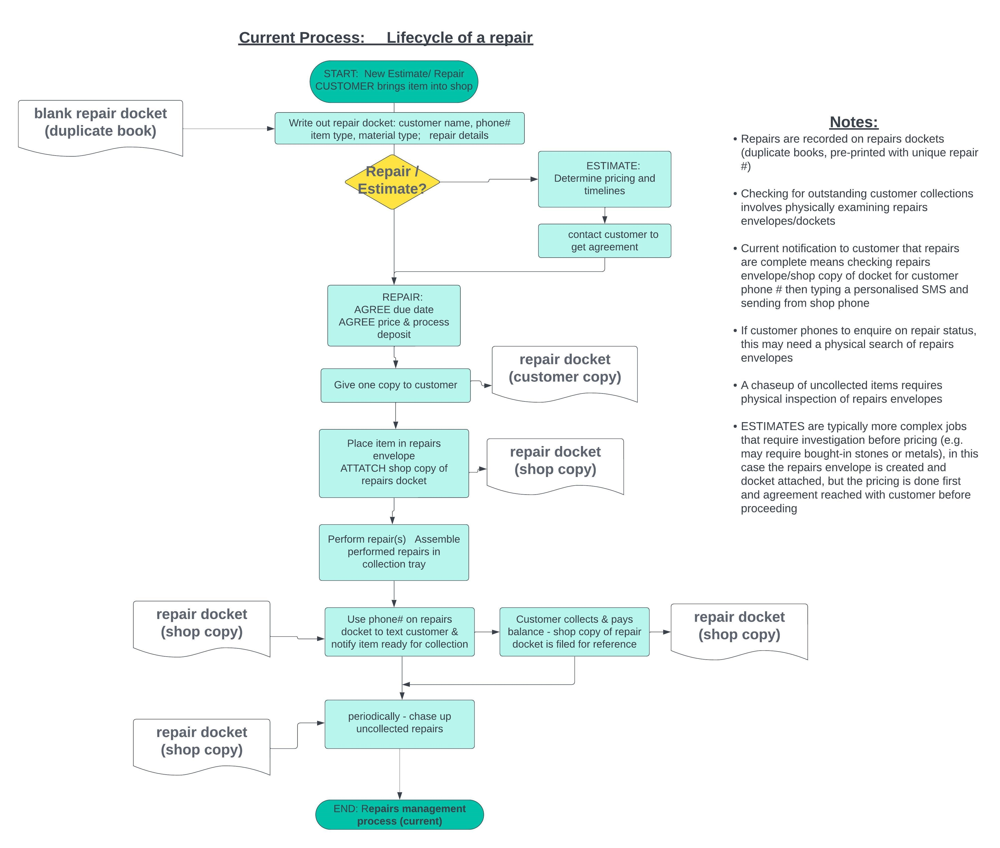
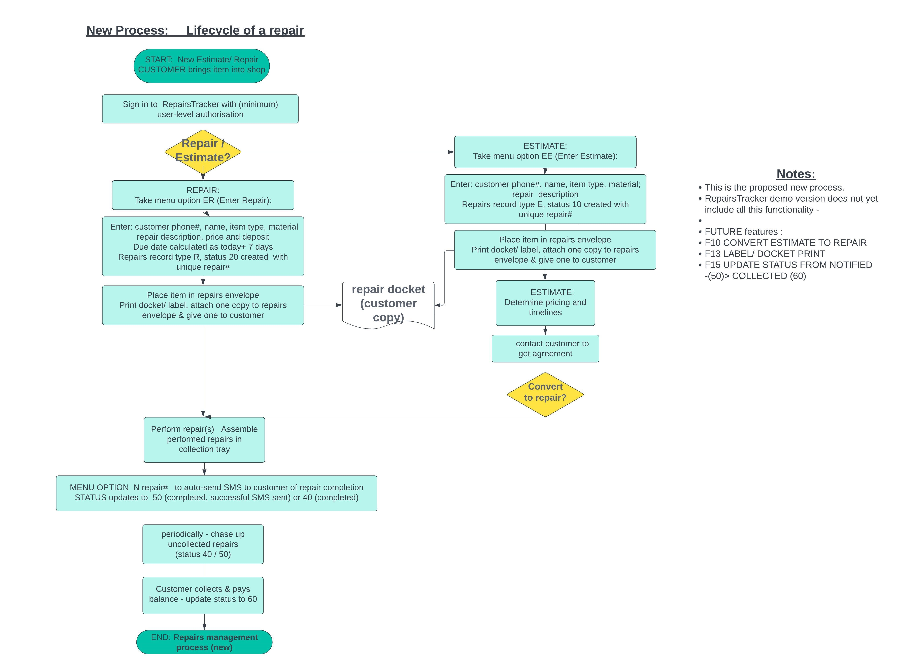
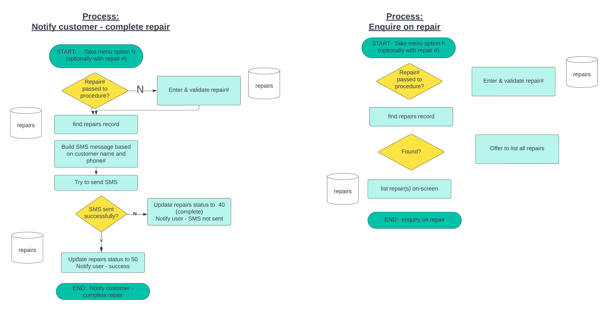
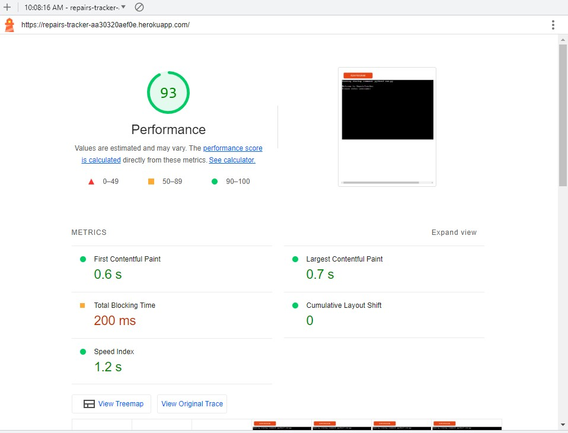

# RepairsTracker
(Developer:  Deirdre McCarthy, July 2023)

# Table of Contents:
1. [About](#about)
2. [Project Goals: ](#project-goals)
    1. [UX Design - Strategy ](#ux-design-strategy) 
    2. [UX Design - Strategy - Competitor Portals](#ux-design-strategy-analysis-of-competitor-offerings)
    3. [UX Design - Strategy - Target Audience](#ux-design-strategy-target-audience)
3. [UX Design - Scope](#ux-design-scope)
    1. [UX Design - Scope - User Requirements and Expectations](#ux-design-scope-user-requirements-and-expectations)
    2. [UX Design - Scope - Data Model](#ux-design-scope-data-model)
    3. [UX Design - Scope - Viewing Device](#ux-design-scope-viewing-device)
4. [User goals/ user stories: ](#user-goals-user-stories)
    1. [Site Owner Goals](#site-owner-goals)
    2. [First-time User Goals](#first-time-user-goals)
    3. [Returning User Goals](#returning-user-goals)
    4. [Other stakeholder Goals](#other-stakeholder-goals)
5. [Further UX Design: ](#ux-design-decisions)
    1. [Skeleton - Flowcharts; ](#flowcharts)
    2. [Surface - Colours](#colour-scheme)
    3. [Surface - Imagery](#design-images)
6. [Features](#features)
    1. [Included](#features-in-scope)
    2. [Future Development](#features-left-to-implement)
7. [Technology](#technologies)
    1. [Languages](#langugages)
    2. [Frameworks and Tools](#frameworks--tools)
8. [Validation](#validation)
    1. [Python Validation](#python-validation)
    2. [Accessibility](#accessibility)
    3. [Performance](#performance)
    4. [Multi-device Testing](#multi-device-testing)
    5. [Multi-browser Testing](#multi-browser-testing)
    6. [Testing user stories](#testing-user-stories)
    7. [Unfixed Bugs](#unfixed-bugs)
9. [Accessibility](#accessibility)
10. [Performance](#performance)
11. [Deployment](#deployment)
12. [Credits](#credits)
    1. [Content](#content)
    2. [Media](#media)
    3. [Code](#code)
    4. [References](#references)
    5. [Acknowledgements](#acknowledgements)

## About
---------
RepairsTracker is a python- and google-sheets DBMS application intended to replace a manual (paper-based) system for tracking the lifecycle of jewellery repair.  This is a real-world requirement. While RepairsTracker described here is a demo version, the app is intended for live use, and has been specified and validated with a real-world user. 

Current business process - jewellery repair

Revised business process - jewellery repair

### Responsive Mockup
A responsive mockup is given here,  although in practice the user interface is a 80-char x 24 line text display regardless of device:
https://ui.dev/amiresponsive?url=https://repairs-tracker-aa30320aef0e.herokuapp.com/

### Live webpage link
https://repairs-tracker-aa30320aef0e.herokuapp.com/

## Project Goals
----------------

1. To automate this existing manual process for repair tracking, from initial entry through to in-progress, customer notification and customer collection/final payment.
2. Using the integration capabilities of python (and associated libraries) to link to Google Sheets as a reasonaby basic DBMS, and bolt-on libraries for SMS notifications (and, in the future, label printing).  
3. Which is not significantly slower than the current manual (handwritten) system.
4. And which provides additional functionality for customer tracking, repairs status reporting.
5. And which provides some capabilities for customisation/ configuration.
  
### UX Design Strategy
As this program is delivered using Python, the emphasis is on functionality rather than appearance.  Options for customising appearance are somewhat restricted.   RepairsTracker appears in 'terminal-mode' display of 24 lines x 80 chars.
 
The elements which can be customised to improve UX in this context are:

* Overall program flow:  ensure a 'natural' flow of activities reflecting the tasks needed to process jewellery repairs (addressing project goal #1). 
Each estimate/repair is assigned a unique number, and status code is used to track each repair through its lifecycle.  This makes current status, workload and throughput of estimates/repairs clearly visible (partly addressing goal #4 via the underlying data structures).

* RepairsTracker also offers some 'type-ahead' capabilities whereby a user familiar with the menu structure can enter an option from the main menu and submenu in one entry, and be taken directly to that option, e.g. ER to enter an repair (E from main menu, then R from submenu); or MI to Maintain (from main menu) Items (from sub-menu).  Type-ahead partially addresses project goal #3.

* Appearance:  The python Colorama library is used to present on-screen text consistently, so the user learns to recognise error/ success/ info/ background messages by their appearance.  This helps to achieve goals #2 and #3 above.

* Automation: use a 3rd party messaging service to automate the (currently manual) task of texting to customer when repairs are completed (project goal #s 1, 2, 3, 4)

* Use of widely available, familiar database backend - Google sheets.  Project goals #4 (reporting) and #5 (ability to configure/customise) would ideally be achieved via the front-end (Python) interface.  While the RepairsTracker solution delivers demo-level functionality for reporting and data customisation, a lot more can be achieved by using standard Google Sheets functionality.  
Users familar with spreadsheets can update the spreadsheet data, add tracking view and reports. 
This is an improvement on the current manual system which can requires a physical search through the repairs to ascertain repair status.
 

### UX Design Strategy Analysis - Existing Repair Tracking Apps
Repair Tracking apps do exist, generally forming part of a wider cloud-based offering for a given software supplier. However, these apps are often  part of larger suites of business modules, for example integrated with payment and inventory systems. As such, implementation involves monthly subscription costs and an implementation effort.
RepairsTracker is a simple approach to meet the repair tracking aspects only.  It is sufficiently customisable for use in a small-medium sized business, and is quick to use 'out of the box'.

### UX Design Strategy Target Audience
Target users are small-medium sized jewellery shops who perform repairs for direct customers (and possibly for other trade customers).

## UX Design Scope
----------------

### UX Design Scope User Requirements and Expectations
 
<ul>MVP Requirements:
<li>Must be intuitive to use</li>
<li>Must be easy to learn</li>
<li>Good for first time or returning users</li>
</ul>
 
<ul>Requirements - Desirable:
<li>Would like to track status of repairs</li>
<li>Would like to be able to configure with system with new options, e.g. for item or metal types</li>
<li>Would like to be able to maintain/ review a list of customers</li>
<li>Would like to be able to automatically notify customers of repairs which are due for collection</li>
<li>Would like to be able to track repairs which are (over)due for collection</li>
<li>Would like to gather data for ad-hoc statistical analysis of repairs (average price, weekly throughput, etc) </li>
</ul>
 

### UX Design Scope - Data Model
A single [Google spreadsheet](https://docs.google.com/spreadsheets/d/1LO_TXPpBZc0xiq5VD1iwtj9MSVeEOlm6eYSkbnScdUQ/edit?usp=sharing) is used to hold the DMBS.

The data has been modelled to loosely represent a RDBMS where each google sheet is named and acts as a 'table' in the database.

* sys_users holds a list of userids/ passwords known to the system, and whether each has user or administrator access;

")

* sys_status holds the lifecycle of an estimate/ repair, and is used to indicate the progress of a repair through its lifecycle

* sys_mat categorises material/metal types (used for input validation when a repair record is created)

* sys_item categorises jewellery items, e.g. (W)atch, (E)arrings (also used for input validation on creation of new repair record)

* sys_cust holds a list of the customers known to the system.  Below is a subset of customer fields. Phone# and name are important within RepairsTracker, several lines of address are held too. 

* repairs is a dynamic table used to track the details of each repair taken into the shop.  This record has more fields than the others, and is the main 'engine' of the system.

## User Goals/ User Stories
----------------
    
### Site owner Goals
* SO_01 As site owner I want to provide a jewellery repair tracking system which meets user requirements
* SO_02 As site owner I want the jewellery repair tracking system to be more efficient than current manual processes
* SO_03 As site owner I want to provide a system which is intuitive and easy to learn 
* SO_04 As site owner I want to provide shortcuts for experienced users, to speed up data entry
* SO_05 As site owner I want to provide automated customer notification when repairs are complete
* SO_06 As site owner I want to ensure that all data entry is validated and captured in conistent format (e.g. mixed case or upper-case as appropriate) to allow for consistent reporting
* SO-07 As site owner I want to provide immediate feedback on erroneous data entry 
* SO-08 As site owner I want to provide basic authentication and security to prevent unauthorised usage
* SO-09 As site owner I want to provide reporting capabilities e.g. for repair status tracking
* SO_10 As site owner I want to develop code and documentation which meets industry (PEP8) standards
* SO-11 (FUTURE) As site owner I want to implement label printing as each repair is entered
* SO_12 (FUTURE) As site owner I want to allow authorised users the ability to configure and expand the system

### First-time User Goals
* FTU_01 As a first time user I want to be able to enter repair details quickly and accurately
* FTU_02 As a first time user I would like to be able to easily navigate the site and quickly learn its functionality 
* FTU_03 As a first time user I would like to be able to access help for the various system functions
* FTU_04 As a first-time user I want clear, timely and unambiguous feedback and interaction 
* FTU_05 As a first-time user I expect links and functions that work as expected

### Returning User Goals
* RU_01 As a returning user I want keyboard shortcuts to speed up data entry, rather than menu-only navigation
* RU_02 As a returning user I want to enter estimates quickly and accurately
* RU_03 As a returning user I want to enter repairs quickly and accurately
* RU_04 As a returning user I want to convert an estimate to a repair 
* RU_05 As a returning user I want to view status of repairs, on an individual or group basis
* RU_06 As a returning user I want to notify customers that their repair is completed and awaiting collection
* RU_07 As a returning user I want to update a repair to show that it has been collected
* RU_08 As a returning user (administrator) I want visibility of system setup data
* RU_09 As a returning user I want to be able to view data (e.g. customers) within the RepairTracker system
* RU_10 (FUTURE) As a returning user (administrator) I want to amend RepairTracker system data
* RU_11 (FUTURE) As a returning user I want to report on repairs by status (e.g. entered, awaiting parts, completed, awaiting collection)
* RU_12 (FUTURE) As a returning user I want to report on repairs by due date (e.g. overdue) 
* RU_13 (FUTURE) As a returning user (administrator) I want to modify the status of a repair record e.g. to 99 (closed by Administrator)

### Other stakeholder Goals
* OT_01 As a customer I want to receive a repair docket with a unique repair # and accurate details when I submit my repair
* OT_02 As a customer I want an initial estimate of when my repair will be ready to collect
* OT_03 As a customer I want to receive prompt notification when my repair is completed
* OT_04 As a cutomer I want to enquire as to the currents status of my repair
* OT_05 (FUTURE) As a customer I would like to receive a reminder if I am overdue in collecting my repair

## UX Design Decisions
----------------

### Flowcharts

Main Menu

Enter repair/estimate

Complete Repair - Notify Customer (also process for Find repair)

 
### Colour Scheme 
Colours & backgrounds are applied consistently to text blocks within RepairsTracker e.g. for error messages, status messages etc.  Using the 'colorama' python library gave the ability to apply some colours and properties (bold, blink, etc) to the text.  This gives a consistent look & feel and helps users to 'get to know' the system.

Colours- used for prompt & feedback to user & to aid user learning

### Design Images
Ideally would like to have a background or splash image.  I did not manage to get an image to display in the background, so compromised with a blue screen background.

Background image

### Design Images - Icons and Symbols
N/a : text-based display

## Features 
 
### F01 Authentication
The user must give a valid userid and password to gain entry to the system (this demo version is provided with u-u for user-level access and s-s for administrator/super-user access) 
 

 
If the user presents with an invalid userid/password they receive an error message and cannot access RepairsTracker.

Unauthorised (non-administrator) users cannot access certain functions e.g. system maintenance.

The implementation of basic authentication satisfies user requirements SO01, SO07, SO08, SO12, FTU02, FTU04, RU08, RU13 
 

### F02 Structured Navigation Menus

 
This gives options identified by a alpha letter.  The user can enter an option (in upper or lower case) and will be brought to the linked sub-menu.
Colours used are consistent for all the menus.
 
This meets user requirements SO01, SO03, FTU01, FTU02, FTU05, RU01.
       

### F03 Typeahead
If the user already knows the option they want to take from the next menu, they can give a 'combined' command from any menu, e.g.
for example: 
* EE (E)nter (E)stimate
* ER (E)nter (R)epair
* F15058 (F)ind repair# 15058
* N15056 (N)otify customer that repair#15056 is completed

This is a handy feature for returning users as, once they are familiar with the system, they can speed up navigation.

This satisfies user stories SO02, SO03, SO04, FTU01, FTU02, FTU05, RU01, RU02.
 

### F04 'Help' Screen

A help text screen is available from main menu, and maintain menu,  option 'H'.  This acts like a user manual and gives a bit more info on each option.  It's a little bit restricted within the 24-line terminal, and ideally the user shouldnt need to scroll to read the help screen.  In any case it gives more details for each menu option.

This satisfies user stories S03, S10, FTU02, FTU03, FTU05. 

### F05 Dynamic Prompts

The value list offered for item type is dynamically built from the contents of sys_type sheet/table.
Similarly the sys_material Google Sheet builds the prompts for material.  
When the user enters a value for either of these fields, the entry is checked agaist the valid codes held in each table.

This satisfies user stories S02, S06, FTU01, FTU03, FTU05 

### F06 Colour coded messages 
Colour coded messages provide consistent and learnable user interface, and assist the user in navigating the system.

 
This feature addresses user stories S03, S06, S07, S10, FTU01, FTU02, FTU04, FTU05, RU02.  
 

### F07 Database held in Google Sheets:

The RepairsTracker underlying database is represented using Google Sheets as an approximation of an RDBMS.  This allows non-routine data updates to be done within Google Sheets rather requiring a customised Python solution for each update.

Ad hoc reporting can also be done from within Google sheets rather than python, e.g. checking for overdue repairs or items outstanding for collection. 

This addresses user stories S01, S02, S04, S12, RU05, RU10, RU11, RU12. 

### F08 Repairs/ Estimate Entry

Both repairs and estimates are stored in the 'repairs' table, and go through similar entry steps.  But they have a different record type (R / E) and status (20 / 10).  

* Each new entry is assigned a record type - (R)epair or (E)stimate, depending on menu option chosen

* Drop-in date - assigned to today, due date - assigned to today +7 days.

* Customer details and item details are recorded, as well as free-text to describe the repair type.

* Status is assigned as 10: estimate; 20: repair ; this indicates the stage in the repair 'lifecycle'.

* Each new repair/estimate is assigned a 'next number' repair # (based on incrementing the previous repair #).

This addresses user stories S01, S02, S03, S04, S06, S07, FTU01, FTU02, FTU04, FTU05, RU01, RU02, RU03, OT01, OT02
 

### F09 Prompted keying of customer data

When entering a repairs record, the user is first asked for the customers phone number.  When entered, this is checked against the customer database  to see if customer is in sys_cust table/sheet.
If so it prompts with the customers name and address and asks the user to verify this is the correct customer.

Pressing Enter accepts the suggested customer.
Alternatively, entering N causes a 'customer name' input prompt to display and a fresh customer name can be entered.  

This is another aspect of addressing user stories S01, S02, S03, S04, S06, FTU01, FTU02, FTU04, FTU05, RU01, RU02, RU03

### F10 Convert Estimate to Repair (FUTURE)
This is a desired feature to address user story 04 for returning users - convert estimate to repair.  This reflects the business process whereby an estimate is created (the item of jewellery might be left in for the duration of the estimate, as possibly stones or metal may need to be priced from external suppliers).  Once the estimate is priced, the customer is contacted and makes a decision whether to proceed with a repair.  In this case it would be useful to be able to convert the estimate to a repair, (future functionality), taking deposit money and assigning a due date.

Internally the system would need to change record type from E to R, and to set the status code from 10 (estimate) to 20 (repair - in progress).
 
 

### F11 Find a repair - including repair status

The (F)ind option is available from the main menu, and typeahead can be used, if desired, to bypass the prompt for repair #.  This shows summary information per repair.  If repair is not found, RepairsTracker will offer to list all repairs:

and will then display a long list of entries:

This meets user requirement FTU02, RU05, RU10, OT04  
 

### F12  Notify Customers
A third-party SMS management service (Twilio) was tested successfully.  It generated messages to a mobile phone number, with a standardised message to represent repairs completion.  This is invoked through the 'notify customers' option.

While this particular SMS mangement service may not be the final solution adopted, the RepairsTracker system has proven capable of
generating a customer notification and sending it to a specified mobile phone #.

(Note that all SMS messages from RepairsTracker are currently sent to a single mobile phone number, which has been declared to the 3rd party SMS messaging provider) 
 
This addresses user stories S01, S02, S05, S09 (partially), FTU05, RU06, OT03
 

### F13 Label/ Docket Printing per Repair (FUTURE)
This is a desired feature to address S11, FTU01, RU02, RU03.
This requirement is currently under clarification with the end user, as initially it was understood that label printing was needed, in order to 
attach a label to the envelope holding the item to be repaired, however it has emerged that what is actually needed is a 2-part docket, one 
copy is attached to the repairs envelope, and one is given to the customer. This requirement will be addressed in the near future.  
 

### F14 Maintain System Configuration data
The 'maintain' feature partially addresses user story S12 - configure and maintain system.  This menu provides an option to list each of the system files.  The output is presented in 'nice' tabular format, which is readable on the 24 x 80 character screen.  

These tables can be amended, by an authorised user in Google Sheets.
Note: the (M)aintain menu also supports type-ahead, so, for example, selecting MI from the main menu, will take the user to (M)aintain (I)tem.
Note: only users with administrative rights can access the maintain menu, other users will receive an error

### F15 Update repair from status 'notified' (50) to 'collected' (60) (FUTURE)
To address user stories RU07 (update status from customer notified -> customer collected) and OT05 (reminder for customer to collect)
a feature is needed to update the status of selected repairs.  This feature is not in scope for this Demo RepairsTracker, but will be
needed once the system is to progress to live implementation.
 

### Features in Scope 

User story checklist showing which features address each story:

And here is the same information, presented from the features perspective; so a checklist of Features linking each to its user story(ies):

RepairsTracker contains:
* 3 menus (main, enter, maintain)
* two entry options (estimates and repair) 
* a customer notification option to send SMS that a repair has been completed, and to update the repair status to 40 (completed) or 50 (completed & text message sent)
* a find option to see summary details for a known repair #, or for all repair #s.

This version of RepairsTracker system is a demo version. Some features are marked as 'future'.  This recognises that, while the RepairsTracker app contains a lot of the core functionality, it doesn't include the full set of features which would be required to meet real-world requirements.

### Implementation Decisions

* Integrated SMS messaging:  The use of a third party SMS notification sevice (Twilio), invoked from within the RepairsTracker python code was a real eye-opener.  Once the use of environment variables (and the necessity to keep them hidden) was understood, and that these could be represented in Heroku as configuration/credential  variables, this opened up a whole world of possibilities.
 

* Google spreadsheets API links:  These were first seen in the 'love sandwiches' project.  These features are enormously powerful and really enjoyable to work with.  I could immediately see how a practical, real-world application could be quickly built, and presented as a low-cost, easily used system with a quick learning curve.

* Inadventent security error with Google links:  However on first making a connection to the RepairsTracker google sheet, I made a mistake and added the google credentials to the creds.json file in my repository and committed, before adding to the gitignore file...... this caused Google to send me numerous notifications that credentials had been possibly exposed on a public site.  After some resistance, I closed out the service account I had created for the Google link, and recreated with a new set of credentials, ensuring that the gitignore file had been first set to ignore the json entries.
This involved some rework which was frustrating but also a good lesson in security!
 

* Use of Tabulate to nicely display spreadsheet data:  The python library 'tabulate' was used to present tabular data in a readable manner, organised into rows and columns.  However I found the 80-character line width quite restrictive as often I wished to display longer field values but tabulate does not wrap well, the data becomes unreadable once wrapped.  I employed two workarounds - rename the column headings to prevent them from forcing a particular column e.g. with single-character data, to take up extra width, and reduced the number of columns on display for some items (e.g. repairs).     

### Features Left to Implement 
The following features would add to the RepairsTracker functionality and improve the user experience.

* F10 Convert Estimate to Repair (FUTURE)
* F13 Label/ Docket Printing per Repair (FUTURE)
* F15 Update repair from status 'notified' (50) to 'collected' (60) (FUTURE)
* Ability to close out a repair record (e.g. uncollected after 12 months) to status 99
* Extend type-ahead to process multiple repair records, e.g. for customer notify, perhaps separated by commas, e.g. N12345,13456,15567 would invoke the 'notify' option and perform updates for 3 individual repair records.
* Show an image screen (with a picture of a jewellers bench) as a splash screen behind the black terminal window.  I attempted to do this using html (as I saw other PP3 project such as the american pizza system had accomplished it) but without success....In my view this would greatly improve the the visual appearance....
 
       
## Technologies

### Langugages
- HTML (for background image splash screen)
- Python V3.1.3
- Javascript

### Frameworks & Tools
* LucidChart was used to draw the systgem flowcharts
* Github was used to hold the project repository and implement versioning
* Gitpod was used for code and readme maintenance
* Google Cloud Platform was used to manage access and permissions to the Google Drive and Google Sheets
* Google Sheets was used to hold the underlying database
* Code Institutes's PEP8 checker was used to check the python code against PEP8 standards
* Heroku was used for deployment of the RepairsTracker demo version 

### Python Libraries
The following were used to extend the functionality of python.  Each required an install in the development environment, and an update to the requirements.txt file with the package name and version.  The requirements.txt file is then carried through and its contents installed when the CI terminal is built in the Production/ Heroku environment. As variety of libaries were tried when developing RepairsTracker, I needed to prune requirements.txt back to just those libraries required for the delivered version.
 

* os - used to pickup environment variable(s) (required for Twilio use)
* dotenv - used to define and retrieve environment variables (required for Twilio use)
* time - used for sleep function

### Third Party Libraries
* google.oauth2.service_account used for Credentials/ permissions management to access the Google API and connect my Service Account with the Credentials function
* gspread - used to access google worksheets/ spreadsheets and to interact with Google APIs to manipulate data within these spreadsheets 
* Twilio Client - used to generate SMS for customer notification once repair is completed
* tabulate - used to present column/row from google sheets in 'nice' format
* Colorama - used to colour messages for most of the on-screen user interaction

## Validation 

### Python Validation 
- PEP8 validation
- The pycodestyle validator is available within the CI GitPod development environment.  It is invoked using pycodestyle run.py.
I used this 3-4 times over the development duration and each time had a long list of errors!  Advised corrections were applied, then the code was re-verified to ensure still working correctly.
- PEP8 Corrections are described in the issue log.

 
- The CI PEP8 validator was also used, by pasting my run.py code into https://pep8ci.herokuapp.com/#
, and confirmed 0 linting issues.

 

### Accessibility
N/A for Python project

### Performance
Performance  - N/A for Python project?
Ran Lighthouse over the heroku app and got 93% performance.

Performance: heroku deployed app

### Device Testing
The website was tested on the following devices:
* HP laptop 
* Samsung Galaxy S10 tablet (the desired final device)
* Motorola G(7) android phone

Testing on the HP laptop performed as expected with no additional errors.
Testing on the Samsung Galaxy tablet, which is the desired end-user device (under Google Chrome), showed a strange anomaly wherby the text the user is entering displays as superscript.  However the user-entered input was processed successfully and the system operated as expected, so it is close-to-functional with a small anomaly.

Testing on the Motorola android phone in a FireFox browser was unsuccessful, the display screen doesn't show correctly in portrait mode, it chops off the first 10 or so characters so menus and prompts cannot be read correctly.  If the screen is put into landscape mode the user cannot access on the on-screen keyboard so cannot make any entries.  It also seemed during one test to have difficulty processing the user input, and doubled up the entries, e.g. 's' becames 'ss'.  This system is totally unusable on the android phone.
(As the python terminal is in fact delivered via a html emulator, it might be possible to modify the CI terminal emulation software to include responsiveness, however such work  is definitely outside the scope of this project!)

### Multi-browser Testing
The website was tested on the following browsers:
* Google Chrome v112.0.5615.138 (HP laptop)
* Google Chrome v112.0.5615.136 (Samsung Galaxy tablet)
* Mozilla Firefox v112.1.0 (Motorola g(7) phone)

### Testing Features
Features were pretty comprehensively tested, and some issues identified.  These tended require programming rework to resolve.  The failed tests were then repeated (rightmost column).  A solution was found for all failing items.

### Testing User Stories
Each of the user stories was evaluated for testing. The focus was on making the earlier tests quite comprehensive, and to refer back to these proofs for some of the related user stories. Issues captured tended to be more 'qualitative' than the feature testing. 

### Issues and Bugs

The issue log below was created based on the results of feature testing and user story testing.  Feature testing typically identified bugs and programming issues that could be resolved with programming rework.
User story testing revealed subjective or usability issues which were not are clearly resolved, generally these involved an amount of debate, exploration and negotiation to arrive at an acceptable compromise or workaround.  This compromise might be acceptable for an agreed period of time, with the intention that a longer-term programmatic solution will be delivered.

Note that there are a couple of implementation decisions described below, which are based on issues experienced through the evolution

* Spam in SMS messaging:  When I configured my Twilio a/c and assigned my mobile number as an authorised recipient of SMS messages within the service, I observed several spam calls to my number.  I therefore decided not to use the entered 'customer mobile phone' number on the RepairsTracker record as was cautious that I might expose other mobile users to unwanted SMS messages or calls (as well as the risk of potentially incurring additional costs).  SMS messages generated from RepairsTracker are now directed to a single mobile number (mine).

* Configuring the Twilio SMS messaging service:  The use of the Twilio service requires a .env (dotenv) varaible within the development environment, this is represented by a configuration variable within the deployed environment. Having got the SMS service working, I was surprised to see the following day, that the deployed version was failing authentication with little information returned to the app.  Eventually I realised that, when double checking the credentials, I had configured the Heroku configuration variable with surrounding "" double quotes, causing it to fail.
The frustration of troubleshooting this error led me to improve the error management by using a try/ except clause for SMS sending and returning a detailed error message (the Twilio error message) when unsuccessful.

## Setup and Deployment
### Setting up a new Python project using Google Sheets:
1. Create the python github repository using template 
https://github.com/Code-Institute-Org/p3-template
2. Create google sheets spreadsheet with appropriate tabs/data
3. Google cloud services - create an account (if you dont have one already)
4. Google cloud services - create project & assign it a name e.g. RepairsTracker
5. Enable Google drive API within the APIs and Services - Library
6. Create a service account and give it a name, e.g. RepairsTracker
7. Create a JSON file for the service account
8. Enable Google sheets API
9. Add json file as creds.json to github repository (note it is a good idea to promptly add this file name to gitignore!)
10. Open the creds.json file and copy out the client_email value (without the surrounding quotes)
11. Share the google spreadsheet with the client email
12.  Connect project to worksheet by installing gspread google-auth
13.  Add import/scope statements to run.py  

### Heroku

This application is deployed from GitHub using Heroku in following steps:

1. Create an account at [Heroku](https://id.heroku.com/).
2. Ensure you have cpatured dependencies used within the workspacein the rquirements.txt file
2. Create & configure Heroku app as follows:
* Sign in to Heroku
* Use the ‘new’ button at top right hand side – select ‘create new app’
* App name :  enter a unique app name e.g. ‘repairs-tracker’ (no uppercase characters permitted)
* Choose a region: Europe
* Click on ‘create app’.
3.	Apply config variables to this app
* Click on settings – Reveal config vars – there are no config vars for this app yet
* Overtype ‘KEY’ with CREDS
* Overtype VALUE with the contents of the cred.json file
* Click ADD
* Add a second key as follows:
* Key: PORT
* Value: 8000
4. Add buidpacks
* Click on ‘Add buildpack’
* Click on ‘python’ icon, then ‘add buildpack’…. 
* This brings you back to main menu, but there are a couple more needed.  
* Click on ‘Add buildpack’ again
* Click on NodeJS, then ‘add buildpack’
* A message is displayed on screen ‘Your new buildpack configuration will be used when this app is next deployed’.
5.	Go to the ‘Deploy’ tab
* Choose deployment method ‘GitHub’,
* Use the Search button to find your repository on github, then confirm you wish to connect to your repository on github, 
* and click on ‘Connect’ button beside that repo.  This links the Heroku app to the github repo.
* Select auto redeploy or manual deploy (auto redeploy suits better as the app is rebuild on each commit)

### GitHub

The program was built using GitHub repository. 
Repository may be forked in the following steps:
1. Go to GitHub repository,
2. Click Fork button (top right).

To fork the repository:
- Go to the GitHub repository
- Click on Fork button in the upper right hand corner

* To clone the repository:
- Go to the GitHub repository
- Locate the Coe button above the list of files and click it
- Select if you prefer to clone using HTTPS, SSH, or Github CLI and click the copy button to copy the URL to you clipboard
- Open Git Bash
- Change the current working directory to the one where you want the cloned directory
- Type git clone and paste the URL from the clipboard($ git clone https://github.com/YOUR-USERNAME/YOUR-REPOSITORY)
- Press Enter to create your local clone

## Credits 
Multiple sources were used in assembling this site.

* Image credits:  https://www.istockphoto.com/ for wallpaper photo of jewellers bench

### Content - Humble Numble
* Inspiration taken from wordle.com
 
### Code - RepairsTracker

### References
The following sites were used for research and improving  understanding while creating this website: 
* https://pythonguides.com/remove-first-character-from-a-string-in-python/
* https://stackoverflow.com/questions/11552320/correct-way-to-pause-a-python-program
* https://blog.finxter.com/python-convert-string-list-to-uppercase/#:~:text=The%20most%20Pythonic%20way%20to,new%20string%20list%2C%20all%20uppercase.
* https://www.studytonight.com/python-howtos/how-to-print-colored-text-in-python
* useriasminna - referenced project to see about tabulating, printing coloured text and adding a background image.  Located at the following URL:  https://github.com/useriasminna/american_pizza_order_system/tree/main 
* My fellow student Leonie McLaughlin for demonstrating Tabulate functionality
* https://stackoverflow.com/questions/1977694/how-can-i-change-my-desktop-background-with-python?rq=4 
* https://stackoverflow.com/questions/71678738/how-i-convert-a-string-representation-of-a-nested-list-into-a-nested-list
* https://tkdocs.com/
* Ulrike Riemenschneider for hints re background image 
* https://devcenter.heroku.com/articles/config-vars for details of how to map environment variables onto the runtime environment
* https://sparkbyexamples.com/python/using-python-dotenv-load-environment-variables/?expand_article=1
* https://www.trendmicro.com/en_ie/research/22/h/analyzing-hidden-danger-of-environment-variables-for-keeping-secrets.html
* https://www.askpython.com/python-modules/tabulate-tables-in-python
* https://twilio.com/docs/libraries/reference/twilio-python/
* https://www.youtube.com/watch?v=n2cF1e2tyhI What Is Twilio? SMS and Voice API's explained - Matt Kander
* https://realpython.com/python-testing/#:~:text=Automated%20testing%20is%20the%20execution,automated%20tests%20for%20your%20application.

 
### Acknowledgements
* I would like to sincerely thank my mentor, Mo Shami for his excellent guidance and support.
* I would like to thank Goldmark jewellers for their patience in explaining requirements to me
* I would also like to thank Derek and my family for their personal support.