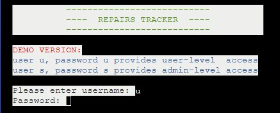
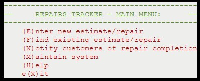

# RepairTracker
(Developer:  Deirdre McCarthy, July 2023)

# Table of Contents:
1. [About](#about)
2. [Project Goals: ](#project-goals)
    1. [UX Design - Strategy ](#ux-design-strategy) 
    2. [UX Design - Strategy - Competitor Portals](#ux-design-strategy-analysis-of-competitor-offerings)
    3. [UX Design - Strategy - Target Audience](#ux-design-strategy-target-audience)
3. [UX Design - Scope](#ux-design-scope)
    1. [UX Design - Scope - User Requirements and Expectations](#ux-design-scope-user-requirements-and-expectations)
    2. [UX Design - Scope - Data](#ux-design-scope-data)
    3. [UX Design - Scope - Viewing Device](#ux-design-scope-viewing-device)
4. [User goals/ user stories: ](#user-goals-user-stories)
    1. [Site Owner Goals](#site-owner-goals)
    2. [First-time User Goals](#first-time-user-goals)
    3. [Returning User Goals](#returning-user-goals)
    4. [Other stakeholder Goals](#other-stakeholder-goals)
5. [Further UX Design: ](#ux-design-decisions)
    1. [Skeleton - Flowcharts; ](#flowcharts)
    2. [Surface - Fonts; ](#fonts-chosen)
    3. [Surface - Colours](#colour-scheme)
    4. [Surface - Imagery](#design-images)
6. [Features](#features)
    1. [Included](#features-in-scope)
    2. [Future Development](#features-left-to-implement)
7. [Technology](#technologies)
    1. [Languages](#langugages)
    2. [Frameworks and Tools](#frameworks--tools)
8. [Validation](#validation)
    1. [Python Validation](#python-validation)
    2. [Accessibility](#accessibility)
    3. [Performance](#performance)
    4. [Multi-device Testing](#multi-device-testing)
    5. [Multi-browser Testing](#multi-browser-testing)
    6. [Testing user stories](#testing-user-stories)
    7. [Unfixed Bugs](#unfixed-bugs)
9. [Accessibility](#accessibility)
10. [Performance](#performance)
11. [Deployment](#deployment)
12. [Credits](#credits)
    1. [Content](#content)
    2. [Media](#media)
    3. [Code](#code)
    4. [References](#references)
    5. [Acknowledgements](#acknowledgements)

## About
---------
RepairTracker is a python- and google-sheets DBMS application intended to replace a manual (paper-based) system for tracking the lifecycle of jewellery repair.  This is a real-world requirement, and while the version of RepairTracker presented is a demo version, the app is presently intended for live use.

### Responsive Mockup
A responsive mockup is given here,  although in practice the user interface is a 80-char x 24 line text display regardless of device:
https://ui.dev/amiresponsive?url=https://repairs-tracker-aa30320aef0e.herokuapp.com/
(and, in fact, the user interface when tested on a mobile device did not function correctly, and operated with anomolies when used on a Samsung Galaxy tablet)

### Live webpage link
https://repairs-tracker-aa30320aef0e.herokuapp.com/

## Project Goals
----------------
1. To automate the existing manual steps for repair tracking, from initial entry through to in-progress, customer notification and collection/payment. 
2. Using the integration capabilities of python (and associated libraries) to link to Google Sheets as a reasonaby basic DBMS, and bolt-on libraries for SMS notifications (and, in the future, label printing).  
3. Which is not significantly slower than the current manual (handwritten) system.
4. And which provides additional functionality for customer tracking, repairs status reporting.
5. And which provides some capabilities for customisation/ configuration, ie access to maintain certain system parameters.
  
### UX Design Strategy
As this program is delivered using Python, the emphasis is on functionality rather than appearance.
However, in line with project goal #3, some features have been included to streamline data entry.  For example, on the main menu, the user can enter a single-character option (E)nter, (H)elp, etc.  When presented with a sub-menu, they can then enter a further single-character option, e.g. the 'Enter' sub-menu has options for (E)stimate, (R)epair, etc.
To streamline data entry, a user familiar with the menu structure can directly enter a multi-character string to immediately access a sub-menu.  A typical example would be ER to choose Enter - Repair.   

Other UX design considerations include meaningful error messages and status messages.
Status code is used to track each repair through its lifecycle.  
This makes current status, workload and throughput of estimates/repairs clearly visible.
As per project goal #4, functionality within RepairTracker allows repairs status to be seen within inquiries and datalists.
 
 
### UX Design Strategy Analysis - Existing Repair Tracking Apps
Commercially available repair tracking apps do exist, however, these often form part of a larger suite of business modules, integrated with payment and inventory systems. As such, implementation involves monthly subscription costs and an implementation effort.
RepairTracker is a simple approach to meet the repair tracking aspects only.  It is sufficiently customisable for use in a small-medium sized business, and is quick to use 'out of the box'.

### UX Design Strategy Target Audience
Target users are small-medium sized jewellery shops who perform repairs for inhouse (and possibly external) customers.

## UX Design Scope
----------------

### UX Design Scope User Requirements and Expectations
 
<ul>MVP Requirements:
<li>Must be intuitive to use</li>
<li>Must be easy to learn</li>
<li>Good for first time or returning users</li>
</ul>
 
<ul>Requirements - Desirable:
<li>Would like to track status of repairs</li>
<li>Would like to be able to configure with system with new options, e.g. for item or metal types</li>
<li>Would like to be able to maintain/ review a list of customers</li>
<li>Would like to be able to automatically notify customers of repairs which are due for collection</li>
<li>Would like to be able to track repairs which are (over)due for collection</li>
<li>Would like to gather data for ad-hoc statistical analysis of repairs (average price, weekly throughput, etc) </li>
</ul>
 

### UX Design Scope - Data
A single Google spreadsheet is used to hold the DMBS.
This is pre-populated with configuration data as follows:
* sys_cust holds a list of the customers known to the system;
* sys_mat holds the type of material/metals and is recorded when a repair is received;
* sys_users holds a list of userids and passwords known to the system, and whether each has user or administrator access;
* sys_item holds jewellery item types, e.g. (W)atch, (E)arrings;
* sys_status holds the lifecycle of an estimate/ repair
 

## User Goals/ User Stories
----------------
    
### Site owner Goals
* SO_01 As site owner I want to provide a jewellery repair tracking system which meets user requirements
* SO_02 As site owner I want the jewellery repair tracking system to be more efficient than current manual processes
* SO_03 As site owner I want to provide a system which is intuitive and easy to learn 
* SO_04 As site owner I want to provide shortcuts for experienced users, to speed up data entry
* SO_05 As site owner I want to provide automated customer notification when repairs are complete
* SO_06 As site owner I want to ensure that all data entry is validated and captured in conistent format (e.g. mixed case or upper-case as appropriate) to allow for consistent reporting
* SO-07 As site owner I want to provide immediate feedback on erroneous data entry 
* SO-08 As site owner I want to provide basic authentication and security to prevent unauthorised usage
* SO-09 As site owner I want to provide reporting capabilities e.g. for repair status tracking
* SO_10 As site owner I want to develop code and documentation which meets industry (PEP8) standards
* SO-11 (FUTURE) As site owner I want to implement label printing as each repair is entered
* SO_12 (FUTURE) As site owner I want to allow authorised users the ability to configure and expand the system

### First-time User Goals
* FTU_01 As a first time user I want to be able to enter repair details quickly and accurately
* FTU_02 As a first time user I would like to be able to easily navigate the site and quickly learn its functionality 
* FTU_03 As a first time user I would like to be able to access help for the various system functions
* FTU_04 As a first-time user I want clear, timely and unambiguous feedback and interaction 
* FTU_05 As a first-time user I expect links and functions that work as expected

### Returning User Goals
* RU_01 As a returning user I want keyboard shortcuts to speed up data entry, rather than menu-only navigation
* RU_02 As a returning user I want to enter estimates quickly and accurately
* RU_03 As a returning user I want to enter repairs quickly and accurately
* RU_04 As a returning user I want to convert an estimate to a repair 
* RU_05 As a returning user I want to view status of repairs, on an individual or group basis
* RU_06 As a returning user I want to notify customers that their repair is completed and awaiting collection
* RU_07 As a returning user I want to update a repair to show that it has been collected
* RU_08 As a returning user (administrator) I want visibility of system setup data
* RU_09 As a returning user I want to be able to view data (e.g. customers) within the RepairTracker system
* RU_10 (FUTURE) As a returning user (administrator) I want to amend RepairTracker system data
* RU_11 (FUTURE) As a returning user I want to report on repairs by status (e.g. entered, awaiting parts, completed, awaiting collection)
* RU_12 (FUTURE) As a returning user I want to report on repairs by due date (e.g. overdue) 
* RU_13 (FUTURE) As a returning user (administrator) I want to modify the status of a repair record e.g. to 99 (closed by Administrator)

### Other stakeholder Goals
* OT_01 As a customer I want to receive a repair docket with a unique repair # and accurate details when I submit my repair
* OT_02 As a customer I want an initial estimate of when my repair will be ready to collect
* OT_03 As a customer I want to receive prompt notification when my repair is completed
* OT_04 As a cutomer I want to enquire as to the currents status of my repair
* OT_05 (FUTURE) As a customer I would like to receive a reminder if I am overdue in collecting my repair

## UX Design Decisions
----------------

### Flowcharts

Main Menu

Enter repair/estimate

Complete Repair - Notify Customer

Customer Collect/ Completion

  
### Fonts Chosen
n/a as this is presented as a 'termina' style window and is therefore quite limited.....
however using the 'colorama' python library gave the ability to apply some colours and properties (bold, blink, etc) to the text.

### Colour Scheme 
Colours & backgrounds are applied consistently to text blocks within RepairsTracker e.g. for error messages, status messages etc.

Colours- used for prompt & feedback to user & to aid user learning

### Design Images
Ideally would like to have a background or splash image which bounds the entry screen as the black and white text based screen drives me up the wall.

Background image

### Design Images - Icons and Symbols
N/a to text-based display

## Features 
 
### F01 Authentication
The user must give a valid userid and password to gain entry to the system (this demo version is provided with u-u for user-level access and s-s for administrator/super-user access) 
These userids and passwords are stored within Google sheets
 

Username and password are required to access RepairTracker

 
If the user presents with an invalid userid/password they receive an error message and cannot access RepairsTracker.

Unauthorised (non-administrator) users cannot access certain functions e.g. system maintenance.

The implementation of basic authentication satisfies user requirements SO01, SO07, SO08, SO12, FTU02, FTU04, RU08, RU13 
 

### F02 Structured Navigation Menus

Main Menu options

 
The main menu lists options each of which is identified by a letter of the alphabet.  The user can enter an option (in upper or lower case) and will be brought to the linked sub-menu.
Heading title., subtitle and content are presented with consistent appearance and colours.  
 
This meets user requirements SO01, SO03, FTU01, FTU02, FTU05, RU01.
       

### F03 Typeahead

typeahead

If, from the main,menu, the user already knows the submenu option they can key this also, e.g. EE to take the (E)nter option from main menu then (E)stimate from sub-menu. 
 
This satisfies user stories SO02, SO03, SO04, FTU01, FTU02, FTU05, RU01, RU02.
 

### F04 'Help' Screen

Help screen

 
A help text screen is available from main menu option 'H'.  This gives more details for each menu option 
This satisfies user stories S03, S10, FTU02, FTU03, FTU05.        
 
 

### F05 Dynamic Prompts

Value list in prompt is built from system table

The value list offered for item type and item material, within the repairs entry processes, is built from the contents of tables
sys_type and sys_material, held within the Google Shhet.  Modifying the values within the google sheets will modify 
the entry prompts shown to the user.
 
This satisfies user stories S02, S06, FTU01, FTU03, FTU05 

### F06 Colour coded messages 
Colour coded messages provide consistent and learnable user interface, and assist the user in navigating the system.

 
This feature addresses user stories S03, S06, S07, S10, FTU01, FTU02, FTU04, FTU05, RU02.  
 

### F07 Database held in Google Sheets:

RepairsTracker in Google Sheets

The RepairsTracker underlying database is represented using Google Sheets as an approximation of an RDBMS.
This has the advantage of allowing non-routine data updates (e.g. of system tables) to be done within Google Sheets rather
than by developing a customised Python solution for each type of update.
Ad hoc reporting can also be done from within Google sheets rather than python, e.g. checking for overdue repairs or items outstanding for collection.  
This addresses user stories S01, S02, S04, S12, RU05, RU10, RU11, RU12. 
 

### F08 Repairs/ Estimate Entry

Repairs/ estimate entry

Enter a repair/ estimate - each captures slightly different fields, although some fields are common to both.  
Each new entry is assigned a record type - (R)epair or (E)stimate
Drop-in date - assigned to today, due date - assigned to today +7 days.
Customer details and item details are recorded, as well as free-text to describe the repair type.
Status is assigned as 10: estimate; 20: repair ; this indicates the stage in the repair 'lifecycle'.
Each new repair/estimate is assigned a 'next number' repair # (based on incrementing the previous repair #).
 
This addresses user stories S01, S02, S03, S04, S06, S07, FTU01, FTU02, FTU04, FTU05, RU01, RU02, RU03, OT01, OT02 

### F09 Prompted keying of customer data

phone# checked for existing & retrieves customer name

When entering a repairs record, the user is first asked for the customers phone number, this is checked against the customer database
to see if customer is already known to RepairsTracker, if so it prompts with the customers name and address and asks the user to verify
this is the correct customer.
Pressing <Enter> accepts the suggested customer, entering <N> causes a 'customer name' input prompt to display and the entered value 
is then used for the new repair record.  
 
This is another aspect of addressing user stories S01, S02, S03, S04, S06, FTU01, FTU02, FTU04, FTU05, RU01, RU02, RU03 

### F10 Convert estimate -> Repair (FUTURE)
This is a desired feature to address RU04. 
 
 

### F11 Find a repair - including repair status

Find repair - tabulated output

The (F)ind option is available from the main menu.  This shows summary information per repair in tabulated form.
 
This meets user requirement FTU02, RU05, RU10, OT04  
 

### F12  Notify Customers

Notify cutomers via SMS

Use of a third-party SMS management service (Twilio) was tested and successfully generated messages to represent repairs completion.
While this particular SMS mangement service may not be the final solution adopted, the RepairsTracker system has proven capable of
generating a customer notification and sending it to a specified mobile phone #.
(Note that all SMS messages from RepairsTracker are currently sent to a single mobile phone number, which has been declared to the 3rd party 
SMS messaging provider) 
 
This addresses user stories S01, S02, S05, S09 (partially), FTU05, RU06, OT03 
 

### F13 Label/ Docket Printing per Repair (FUTURE)
This is a desired feature to address S11, FTU01, RU02, RU03.
This requirement is currently under clarification with the end user, as initially it was understood that label printing was needed, in order to 
attach a label to the envelope holding the item to be repaired, however it has emerged that what is actually needed is a 2-part docket, one 
copy is attached to the repairs envelope, and one is given to the customer. This requirement will be addressed in the near future.  
 
 

### F14 Maintain System Configuration data

Menu

Example - item type

Example - lifecycle

This is a desired feature to address S12 - configure and maintain system.  The requirement is partially met with the (M)aintain option 
from the main menu.  Implementation at this time has been to provide an option to select each of the system files, and see a tabulated
presentation of its contents.  It is possible to amend these tables directly within Google Sheets.
Note: the (M)aintain menu also supports typeahead, so, for example, selecting MI from the main menu, will take the user to (M)aintain (I)tem.
Note: only users with administrative rights can access the maintain menu.

### F15 Update repair from status 'notified' (50) to 'collected' (60) (FUTURE)
To address user stories RU07 (update status from customer notified -> customer collected) and OT05 (reminder for customer to collect)
a feature is needed to update the status of selected repairs.  This has not been included in this RepairsTracker version however it will be
needed once the system is to progress to live implementation.

### Features in Scope 

Mapping of user stories to features

As this website is a python project, effectively this runs in a python emulator which is built using html and javascript.
The presentation is 'terminal mode' ie text-based on a dark background.
So RepairsTracker does not contain 'pages' as such, rather it contains:
3 menus (main, enter, maintain)
a help page
two entry options (estimates and repair) 
and various supporting options to manage the lifecycle of an estimate or repair.

Note that some of the features are shown as 'future', the RepairsTracker system as delivered can be considered a demo version, it does not include
all the functionality that is needed in a real-world application, however it does include essential functions and a lot of the back-end features to
support these, and to support a wider system. 

### Implementation Decisions
The use of a third party SMS notification sevice (Twilio), invoked from within the RepairsTracker python code was a real eye-opener.  Once the use of environment variables (and the necessity to keep them hidden) was understood, and that these could be represented in Heroku as configuration/credential  variables, this opened up a whole world of possibilities.
However, once I had assigned my mobile number as an authorised recipient of SMS messages within the service, I observed several spam calls to my number, therefore decided not to use the 'customer mobile phone' number tracked on the RepairsTracker record, and any SMS messages generated are sent only to one mobile number (mine).
I also extended the error handling as at one point I inadvertently mistyped the credentials into the Heroku server (I retained the surrounding "" double quotes) and could not understand why the production version had stopped working.... a meaningful error message from the Twilio service now shows when an SMS fails to send.

Google spreadsheets update, as first seen in the 'love sandwiches' project, is enormously powerful and I really enjoyed working with this as I could immediately see how a practical, real-world application could be quickly built, and presented as a low-cost, easily used system with a quick learning curve.
However on first making a connection to the RepairsTracker google sheet, I made a mistake and added the google credentials to the creds.json file in my repository and committed, before adding to the gitignore file...... this caused Google to send me numerous notifications that credentials had been possibly exposed on a public site.  After resisting for some time, I eventually closed out the first service account I had created for the Google link, and recreated with a new set of credentials.

 

### Features Left to Implement
The following features are described in the previous section, and an explanation is given of each requirement.
F10 Convert estimate -> Repair (FUTURE)
F13 Label/ Docket Printing per Repair (FUTURE)
F15 Update repair from status 'notified' (50) to 'collected' (60) (FUTURE)
 
In general, improved searching and retrieval of records, as well as specific record updates would improve the RepairTracker capabilities and
make it more usable in a real-world environment.   

I would also like to extend the typeahead feature (F03) as follows:
In the future, for more complex processes which may involve updates/searching for a number of repair records, the user could typeahead giving multiple repair numbers, separated by a comma:
e.g. F12345,13456,15567 opens the find option and asks it to process 3 specific repairs records.

I would very much like to show a display screen (with a picture of a jewellers bench) as a splash screen behind the black terminal window.  I attempted to do this using html (as I saw other PP3 project such as the american pizza system had accomplished it) but without success....I will continue to work on this challenge as I think it would greatly improve the visual appearance....
 
                
## Technologies

### Langugages
- HTML (small bit for attempting splash screen)
- Python V3.1.3
- Javascript

### Frameworks & Tools
* Github:  used to maintain the code repository, and for some readme edits and commits
* Git
* Gitpod:  used for editing and for tracking code commits back to Github
* Balsamiq:  used for wireframing
* Google Fonts: used to locate suitable fonts for website

### Libraries
* Twilio Client - used to generate SMS for customer notification once repair is completed
* gspread - used to access google worksheets/ spreadsheets 
* google.oauth2.service_account used for Credentials/ permissions management
* os - used to pickup environment variable(s)
* dotenv - used to picup environment variables
* time - used for sleep function
from termcolor import colored
from tabulate import tabulate
matplotlib.use('Agg')
* # from wallpaper import set_wallpaper, get_wallpaper
import tk
# import tkinter

## Validation 

### Python Validation 
- PEP8 validation
- The pycodestyle validator within the GitPod environment was used on 04/07/23 and, after corrections, returned 0 errors.
- Corrections required included over-long lines; whitespaces at end of lines - or on blank lines, missing spaces around operators
- under- or over-indentation, incorrect # of blank lines between functions.  When first run there were over 50 PEP8 errors present, 
- this was reduced to 0 by applying advised corrections, then verifying that the resulting code still functioned correctly.

https://pep8ci.herokuapp.com/#
The CI PEP8 validator was also used, by pasting my run.py code into here, and on 04/07/23 confirmed 0 linting issues.

Validation: CI PEP8 validator

### Accessibility
N/A for Python project

### Performance
Performance  - N/A for Python project?
Just in case - Ran Lighthouse over the heroku app and got 93% performance.

Performance: heroku deployed app

### Device Testing
The website was tested on the following devices:
* HP laptop
* Samsung Galaxy S10 tablet
* Motorola G(7) android phone

### Multi-browser Testing
The website was tested on the following browsers:
* Google Chrome v112.0.5615.138 (HP laptop)
* Google Chrome v112.0.5615.136 (Samsung Galaxy tablet)
* Mozilla Firefox v112.1.0 (Motorola g(7) phone)

### Testing User Stories

### Bugs and issues

issue tracker

Quite a few calculation and display issues were encountered during development, the above lists the issues encountered and resolved.

## Deployment
 
* The site was deployed to GitHub pages. The steps to deploy are as follows: 
  - In the GitHub repository, navigate to the Settings tab - pages 
  - From the source section drop-down menu, select the Master Branch
  - Once the master branch has been selected, the page will be automatically refreshed with a detailed ribbon display to indicate the successful deployment. 

The live link can be found here - https://deemccart.github.io/CI_PP2_Humble_Numble/index.html

* To fork the repository:
- Go to the GitHub repository
- Click on Fork button in the upper right hand corner

* To clone the repository:
- Go to the GitHub repository
- Locate the Coe button above the list of files and click it
- Select if you prefer to clone using HTTPS, SSH, or Github CLI and click the copy button to copy the URL to you clipboard
- Open Git Bash
- Change the current working directory to the one where you want the cloned directory
- Type git clone and paste the URL from the clipboard($ git clone https://github.com/YOUR-USERNAME/YOUR-REPOSITORY)
- Press Enter to create your local clone

## Credits 
Multiple sources were used in assembling this site.

* Image credits:  https://www.istockphoto.com/ for wallpaper photo of jewellers bench

### Content - Humble Numble
* Inspiration taken from wordle.com
 
### Code - Humble Numble
* https://laracasts.com/series/wordle-workshop/episodes/2 for tips on building a wordle-like grid (using HTML or JS)
* https://www.youtube.com/watch?v=j7OhcuZQ-q8 Build a Wordle clone using HTML, CSS & Javascript! : used for tips on keyboard panel building (but thereafter preferred to code independently as found that coding shortcuts proposed were not always comprehensible to a new JS developer!)

### References
The following sites were used for research and improving  understanding while creating this website: 
* https://pythonguides.com/remove-first-character-from-a-string-in-python/
* https://stackoverflow.com/questions/11552320/correct-way-to-pause-a-python-program
* https://blog.finxter.com/python-convert-string-list-to-uppercase/#:~:text=The%20most%20Pythonic%20way%20to,new%20string%20list%2C%20all%20uppercase.
* https://www.studytonight.com/python-howtos/how-to-print-colored-text-in-python
* useriasminna - referenced project to see about tabulating, printing coloured text and adding a background image.  Located at the following URL:  https://github.com/useriasminna/american_pizza_order_system/tree/main 
* My fellow student Leonie McLaughlin for demonstrating Tabulate functionality
* https://stackoverflow.com/questions/1977694/how-can-i-change-my-desktop-background-with-python?rq=4 
* https://stackoverflow.com/questions/71678738/how-i-convert-a-string-representation-of-a-nested-list-into-a-nested-list
* https://tkdocs.com/
* Ulrike Riemenschneider for hints re background image 
* https://devcenter.heroku.com/articles/config-vars for details of how to map environment variables onto the runtime environment
* https://sparkbyexamples.com/python/using-python-dotenv-load-environment-variables/?expand_article=1
* https://www.trendmicro.com/en_ie/research/22/h/analyzing-hidden-danger-of-environment-variables-for-keeping-secrets.html
* https://www.askpython.com/python-modules/tabulate-tables-in-python
* https://twilio.com/docs/libraries/reference/twilio-python/
* https://www.youtube.com/watch?v=n2cF1e2tyhI What Is Twilio? SMS and Voice API's explained - Matt Kander
* https://realpython.com/python-testing/#:~:text=Automated%20testing%20is%20the%20execution,automated%20tests%20for%20your%20application.

 
### Acknowledgements
* I would like to sincerely thank my mentor, Mo Shami for his excellent guidance and support.
* I would also like to thank Derek and my family for their personal support.

# Reminders

- Your code must be placed in the `run.py` file
- Your dependencies must be placed in the `requirements.txt` file
- Do not edit any of the other files or your code may not deploy properly

## Creating the Heroku app

When you create the app, you will need to add two buildpacks from the _Settings_ tab. The ordering is as follows:

1. `heroku/python`
2. `heroku/nodejs`

You must then create a _Config Var_ called `PORT`. Set this to `8000`

If you have credentials, such as in the Love Sandwiches project, you must create another _Config Var_ called `CREDS` and paste the JSON into the value field.

Connect your GitHub repository and deploy as normal.

## Constraints

The deployment terminal is set to 80 columns by 24 rows. That means that each line of text needs to be 80 characters or less otherwise it will be wrapped onto a second line.
