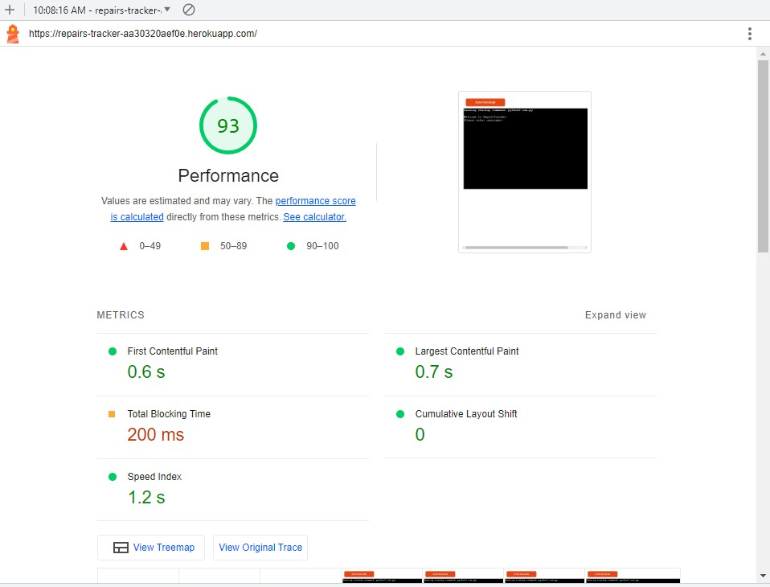

### Python Validation 
- PEP8 validation
- The pycodestyle validator is available within the CI GitPod development environment.  It is invoked using pycodestyle run.py.
It was used on 04/07/23 and 10/07/23 and, after corrections on each occasion, returned 0 errors.
 

 
The CI PEP8 validator was also used, by pasting my run.py code into https://pep8ci.herokuapp.com/#
, and on 04/07/23 and 10/07/23 confirmed 0 linting issues.

Validation: CI PEP8 validator

- Corrections included:

* over-long lines; 
* whitespaces at end of lines - or on blank lines, 
* missing spaces around operators
* under- or over-indentation, 
* incorrect # of blank lines between functions.  
 
When first run (on each occasion!) there were over 50 PEP8 errors present. 
Advised corrections were applied, then the code was re-verified to ensure still working correctly.

### Accessibility
N/A for Python project

### Performance
Performance  - N/A for Python project?
Just in case - Ran Lighthouse over the heroku app and got 93% performance.

Performance: heroku deployed app

### Device Testing
The website was tested on the following devices:
* HP laptop 
* Samsung Galaxy S10 tablet (the desired final device)
* Motorola G(7) android phone

Testing on the HP laptop performed as expected with no additional errors.
Testing on the Samsung Galaxy tablet, which is the desired end-user device (under Google Chrome), showed a strange anomaly wherby the text the user is entering displays as superscript.  However the user-entered input was processed successfully and the system operated as expected, so it is close-to-functional with a small anomaly.

Testing on the Motorola android phone in a FireFox browser was unsuccessful, the display screen doesn't show correctly in portrait mode, it chops off the first 10 or so characters so menus and prompts cannot be read correctly.  If the screen is put into landscape mode the user cannot access on the on-screen keyboard so cannot make any entries.  It also seemed during one test to have difficulty processing the user input, and doubled up the entries, e.g. 's' becames 'ss'.  This system is totally unusable on the android phone.
(As the python terminal is in fact delivered via a html emulator, it might be possible to modify the CI terminal emulation software to include responsiveness, however such work  is definitely outside the scope of this project!)

### Multi-browser Testing
The website was tested on the following browsers:
* Google Chrome v112.0.5615.138 (HP laptop)
* Google Chrome v112.0.5615.136 (Samsung Galaxy tablet)
* Mozilla Firefox v112.1.0 (Motorola g(7) phone)

### Testing Features
Features were test, and some issues identified.  These were then resolved and the failed tests were repeated (rightmost column).  A solution was found for all failing items.

### Testing User Stories
Each of the user stories was evaluated for testing. The focus was on making the earlier tests quite comprehensive, and to refer back to these proofs for some of the related user stories. Issues captured were 'qualitative' as well as 

Screenprints listed within the testing grid are listed here:

### Issues and Bugs
* Spam in SMS messaging:  When I configured my Twilio a/c and assigned my mobile number as an authorised recipient of SMS messages within the service, I observed several spam calls to my number.  I therefore decided not to use the entered 'customer mobile phone' number on the RepairsTracker record as was cautious that I might expose other mobile users to unwanted SMS messages or calls (as well as the risk of potentially incurring additional costs).  SMS messages generated from RepairsTracker are now directed to a single mobile number (mine).

* Configuring the Twilio SMS messaging service:  The use of the Twilio service requires a .env (dotenv) varaible within the development environment, this is represented by a configuration variable within the deployed environment. Having got the SMS service working, I was surprised to see the following day, that the deployed version was failing authentication with little information returned to the app.  Eventually I realised that, when double checking the credentials, I had configured the Heroku configuration variable with surrounding "" double quotes, causing it to fail.
The frustration of troubleshooting this error led me to improve the error management by using a try/ except clause for SMS sending and returning a detailed error message (the Twilio error message) when unsuccessful.

The issue log below was created based on the results of feature testing and user story testing.  Feature testing typically identified bugs and programming issues that could be resolved with programming rework.
User story testing revealed subjective or usability issues which were not are clearly resolved, generally these involved an amount of debate, exploration and negotiation to arrive at an acceptable compromise or workaround.  This compromise might be acceptable for an agreed period of time, with the intention that a longer-term programmatic solution will be delivered.

